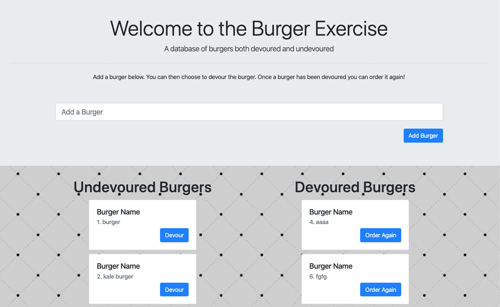

# burgers
<h2> <a href="https://apo-burgers.herokuapp.com/">An exercise in Handlebars and MySQL</a></h2>
&nbsp;
<!--  -->

<h3>This project was built with:</h3>
<ul>
    <li>JavaScript</li>
    <li>jQuery</li>
    <li>CSS</li>
    <li>Bootstrap</li>
    <li>HTML</li>
    <li>MySQL</li>
    <li>Express</li>
    <li>Handlebars.js</li>
    <li>Node</li>
    <li>Hosted on Heroku</li>
</ul>